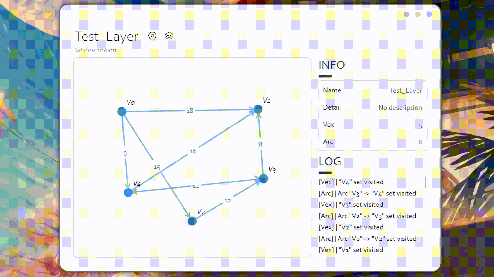

# GraphBuilder

This is a project inspired by my Data Structure & Algorithm Course homework, it's used to create and visualize graphs both directed or undirected, and supports underlaying data structure of either adjacent list or multiple adjacent list

## Functionalities

- Create, save or read multiple layers (or might say multiple palettes)
- Draw or remove nodes and edges
- Change name, position of nodes
- Change width, direction of edges
- Animate BFS, DFS and Dijkstra's algorithm
- Change animation speed
- Change the underlaying data structure
- Change the type of graph (directed or undirected)
- Display the generated minimum spanning tree (by hiding unvisited items)
- Support algorithms on forests

## Deploy and run

If you want to use the packed executable, you can download it from the [release page](https://github.com/Linloir/GraphBuilder/releases)

If you want to view the source code and run it from QT Creator, you might need:

- QT 6.1 or above
- QT Creator installed
- QT build kit (MSVC or MinGW) installed

Armed with the above, you can clone the repository and open the project from `GraphBuilder.pro` file in QT Creator.

## Screenshots

